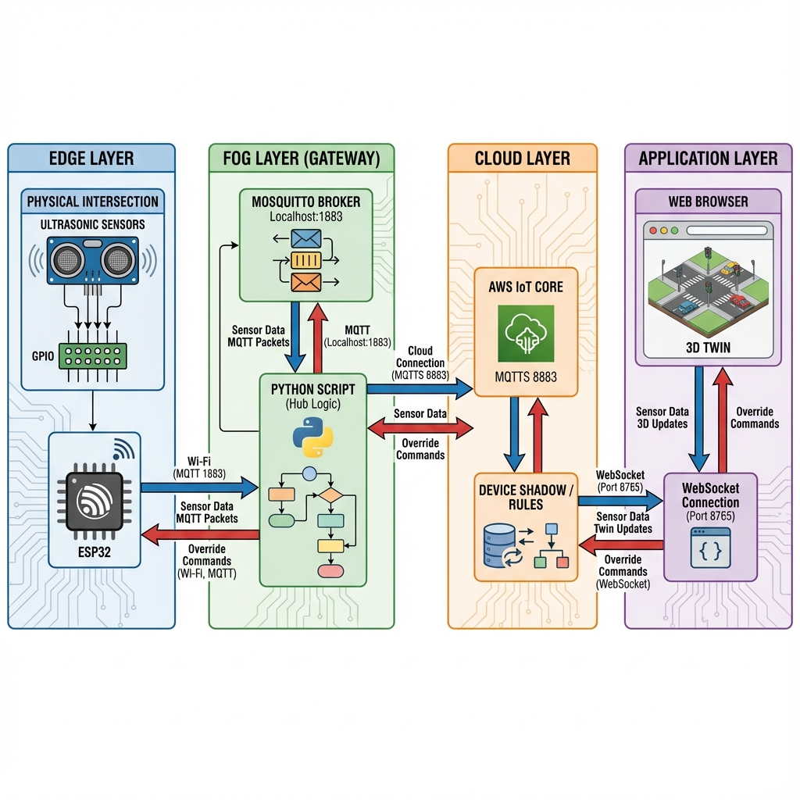

# IoT Traffic Control System

A smart traffic management system leveraging **ESP32**, **AWS IoT Core**, and a local **Python Gateway** to optimize intersection flow and provide remote override capabilities.

## 📌 Features
- **Smart Switching:** Prioritizes lanes with higher traffic density (detected via ultrasonic sensors).
- **Cloud Integration:** Bridges local MQTT traffic to AWS IoT Core for remote monitoring and logging.
- **Remote Control:** Web-based dashboard to view active devices and issue emergency green-light overrides.
- **Local Fallback:** Continues operation even if internet connectivity is lost (Local Priority Logic).

## 🏗 System Architecture

1.  **Edge (ESP32):** 
    - Controls 4-way Traffic Lights (Red/Green LEDs).
    - Reads 4 Ultrasonic Sensors (HC-SR04).
    - Logic: "7cm Priority" - Automatically switches green light if a car is close (<7cm) to a red light sensor while the current lane is empty.
2.  **Gateway (`backend/traffic_gateway.py`):**
    - Runs on a PC/Raspberry Pi.
    - Bridges the local MQTT network (Mosquitto) with AWS IoT Core (MQTT over TLS).
    - Hosts a WebSocket server to stream real-time logs to the Web Dashboard.
3.  **Web Dashboard (`backend/gui_server.py`):**
    - Provides a UI to view status and manually override traffic lights.
    - Connects directly to AWS IoT cloud to send command messages down to the gateway/ESP32.

## 🛠 Hardware Requirements
- **ESP32 Development Board**
- **4x Traffic Light Modules** (or simple Red/Green LEDs)
- **4x HC-SR04 Ultrasonic Sensors**
- Breadboard & Jumper Wires

### Pin Mapping (ESP32)
| Component | Lane 0 | Lane 1 | Lane 2 | Lane 3 |
|-----------|--------|--------|--------|--------|
| **Echo**    | 18     | 19     | 21     | 22     |
| **Red LED** | 13     | 14     | 26     | 33     |
| **Green LED**| 12    | 27     | 25     | 32     |
| **Trigger** | 5 (Shared for all) | | | |

## 🚀 Installation & Setup

### 1. ESP32 Firmware
1.  Open `firmware/esp32_traffic.ino` in Arduino IDE.
2.  Install libraries: `PubSubClient`, `WiFi`.
3.  Update `ssid`, `password`, and `mqtt_server` (IP of your Gateway PC) in the code.
4.  Upload to ESP32.

### 2. AWS IoT Certificates
**IMPORTANT:** Place your AWS IoT certificates in the `config/` directory. Do **NOT** commit these to GitHub.
- `config/certificate.pem.crt`
- `config/private.pem.key`
- `config/root-CA.crt`

### 3. Python Gateway & GUI
1.  Install dependencies:
    ```bash
    pip install AWSIoTPythonSDK paho-mqtt websockets asyncio
    ```
2.  Start the Gateway (Bridge):
    ```bash
    python backend/traffic_gateway.py
    ```
3.  Start the Web GUI:
    ```bash
    python backend/gui_server.py
    ```
4.  Open `http://localhost:8090` in your browser.

## 🔒 Security Note
This repository uses a `.gitignore` to explicitly exclude `.pem`, `.crt`, and `.key` files. **Never share your private keys.**

## 📜 License
[MIT](LICENSE)
